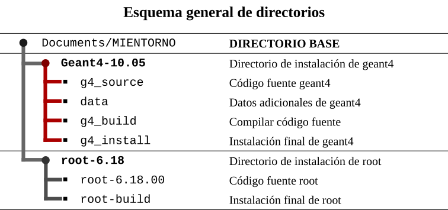
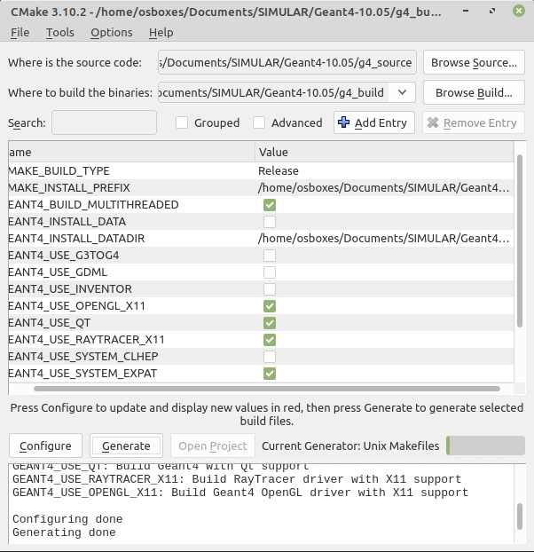
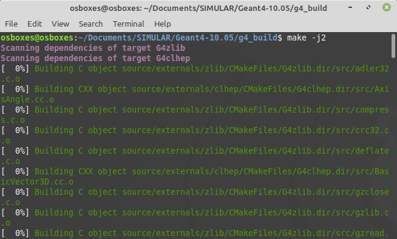
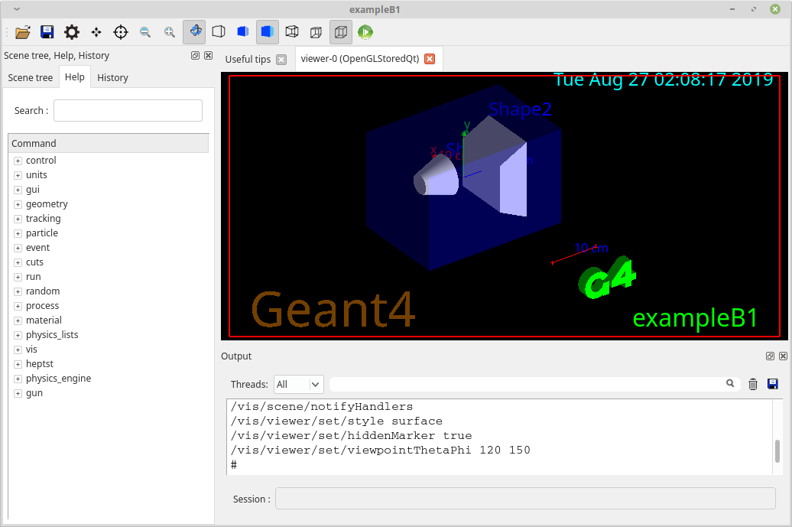

# Instalación de Geant4-10.05.p01

## Instalación desde el código fuente



1. **Descargar** el código fuente desde la página oficial de **Geant4 10.05.p01**

   [Gnu or Linux tar format, compressed using gzip](http://geant4.web.cern.ch/support/download)

2. **Descargar** los 12 ***paquetes adicionales*** de la sección: *DATA FILES ( )*.

   Son necesarios para ejecutar los ejemplos que trae Geant4.  Son en total 12 archivos: G4NDL4.5, G4EMLOW7.7, G4PhotonEvaporation5.3, etc., (Aproximadamente 2.2GB) se puede omitir este paso si se posee una conexion a internet muy estable en latencia además velocidad de descarga.

3. **Descomprimir** el código fuente y renombrar la carpeta de la siguiente forma:

   *geant4.10.05.p01* --- a ---> *g4_source*

4. Prestar atención al esquema de instalación.

   Puedes cambiar libremente el nombre del directorio base, aqui: **SIMULAR**

5. **Mover** la carpeta **g4_source** a la ruta de instalación: ***/home/USUARIO/SIMULAR/Geant4-10.05/***

6. **Descomprimir** los archivos adicionales dentro de una carpeta denominada: **data**

7. **Mover** la carpeta **data** a la ruta de instalación: ***/home/USUARIO/SIMULAR/Geant4-10.05/***

8. Dentro de la ruta de instalación crear dos directorios adicionales:

   **geant_build** y **geant_install**

9. En este punto debemos tener el siguiente lo siguiente

   ```bash
   $ ls
   ```

   ```bash
   output:
   data  g4_build  g4_install  g4_source  geant4.10.05.p01.tar.gz
   ```

10. Configuar `cmake`. Utilizaremos el modo interfaz gráfica

    ```bash
    $ cmake-gui
    ```

    En la interfaz gráfica seleccionamos los siguiente:

    * Source code  = /home/USUARIO/Documents/SIMULAR/Geant4/g4_source

    * Build binaries  = /home/USUARIO/Documents/SIMULAR/Geant4/g4_build

    * Clic en *configurar*

    * Clic en *finish*

      

11. Activar las características de Geant4

    Recomiendo instalar las siguientes opciones, son útiles para cualquier situación en la que se esté trabajando, si embargo, los detalles se pueden ver en [http://geant4-userdoc.web.cern.ch](http://geant4-userdoc.web.cern.ch/geant4-userdoc/UsersGuides/InstallationGuide/html/installguide.html)

    - [x] MAKE_INSTALL_PREFIX =  /home/USUARIO/Documents/SIMULAR/Geant4/g4_build
    - [x] GEANT4_BUILD_MULTITHREADED
    - [x] GEANT4_INSTALL_DATA
    - [x] GEANT4_INSTALL_DATADIR = /home/USUARIO/Documents/SIMULAR/Geant4/data
    - [x] GEANT4_USE_OPENGL_X11
    - [x] GEANT4_USE_QT
    - [x] GEANT4_USE_RAYTRACER_X11
    - [x] GEANT4_USE_SYSTEM_EXPAT

    

12. Clic en ***Configure*** dos veces si fuera necesario (no se debe ver marcadores rojos)

13. Clic en ***Generate*** y cerrar cmake.

    | cmake                   | cmake + características |
    | ----------------------- | ----------------------- |
    |  |  |

14. Abrir una terminal en el directorio g4_build

    ```bash
    $ cd /home/USUARIO/Documents/SIMULAR/Geant4-10.05/g4_build/
    ```

15. Compilar

    ```bash
    $ make -j4
    ```

    Aquí `j4` indica el número de núcleos que asignaremos a la tarea. A mayor cantidad de núcleos menor tiempo en realizar la tarea y viceversa. Depende de tu ordenador.

    

    

16. Instalar Geant4

    ```bash
    $ make install
    ```

    

17. Fijar al variables de entorno (temporal)

    Esto método de fijar las variables de entorno si tiene que hacer cada vez que se cierre la terminal. Caso contrario, se tiene que fijar de forma persistente que es lo recomendado.

    ```bash
    $ source /home/USUARIO/Documents/SIMULAR/Geant4-10.05/g4_install/bin/geant4.sh
    ```

    O entrar al directorio de instalación dentro de la carpeta **bin**

    ```bash
    $ source geant4.sh
    ```

18. Listo! Geant4 esta correctamente instalado.


## Configurar entorno de variables (persitente)

El proceso es el siguiente:

- Abrir el directorio home: */home/*USUARIO/

- Presionar `Crtl + H` para ver los archivos ocultos.

- Localizar el archivo `.bashrc`

- Abrir `.bashrc` con un editor de texto, ir al final del todo y pegar lo siguiente:

  (Cambia USUARIO por el tuyo)

  ```bash
  # Entorno de Geant4 y ROOT
  source /home/USUARIO/Documents/SIMULAR/Geant4-10.05/g4_install/bin/geant4.sh
  ```

- Guardamos, salimos y presionar nuevamente `Crtl + H` para regresar todo a la normalidad.

- Ahora podemos ejecutar *geant4* desde cualquier parte del ordenador en todo momento que lo necesitemos.


## Ejecutar una simulación

1. **Crear un directorio de trabajo** dentro del directorio base

   ```bash
   $ cd /home/USUARIO/Documents/SIMULAR/
   $ makdir g4_work
   ```

2. **Copiar un ejemplo** de Geant4 en el directorio de trabajo

   Los ejemplos se encuentran en : /home/USUARIO/Documents/SIMULAR/geant4-10.5.1/g4_install/share/Geant4-10.5.1/examples/

   

3. En nuestro caso hemos copiado el ejemplo /Basic/B1

4. Dentro del ejemplo hacemos lo siguiente:

   ```bash
   $ mkdir build
   $ cd build
   ```

5. Contruimos el paquete con `cmake`

   ```bash
   $ camke ../
   ```

6. Compilar

   ```bash
   $ make -j2
   ```

7. Listar los objetos del directorio y debemos ver un ejecutable

   ```bash
   $ ls
   ```

   ```bash
   output:
   CMakeCache.txt  cmake_install.cmake  exampleB1.in   G4History.macro  Makefile run2.mac
   CMakeFiles      exampleB1            exampleB1.out  init_vis.mac     run1.mac  vis.mac
   ```

8. Ejecutar la simulación

   ```bash
   $ ./exampleB1
   ```

   

## Resultado

