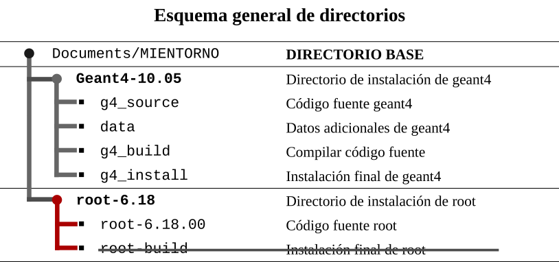
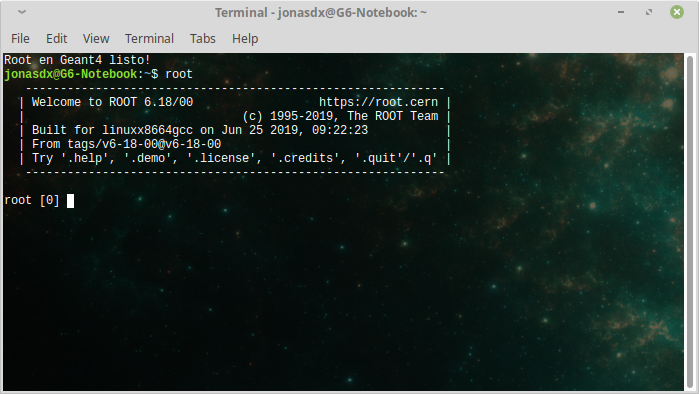

# Instalación pre-compilada de ROOT 6.18

Este proceso de instalación se recomienda para usuarios noveles o siempre que no se desee hacer un uso intensivo de ROOT. Para otros fines es mejor utilizar el proceso de [compilación](/ROOT/install_ROOT.md).

------




## Pasos a seguir:

1. ACTUALIZAR la distribución de Linux a la versión más reciente:

   ```bash
   $ sudo apt update
   ```

   ```bash
   $ sudo apt upgrade
   ```

2. INSTALAR DEPENDENCIAS

   La lista detallada se puede revisar aquí [ROOT](https://root.cern.ch/build-prerequisites). Los paquetes han sido cuidadosamente revisados de acuerdo a base de datos de paquetes de [Ubuntu/bionic](https://packages.ubuntu.com/).

   **Librerías necesarias (sin esto no funciona)**

   ```bash
	$ sudo apt install cmake cmake-qt-gui g++ gcc gfortran binutils libx11-dev libxpm-dev libxft-dev libxext-dev libpng-dev libpng++-dev libjpeg-dev
   ```
   
   Librerías importantes (opcionales)

   ```bash
	$ sudo apt install git libssl-dev libpcre3-dev libftgl-dev libmysqlclient-dev libfftw3-dev libcfitsio-dev graphviz-dev libavahi-compat-libdnssd-dev libldap2-dev python-dev libxml2-dev libkrb5-dev libgsl23 libgsl-dev
   ```
   
   
   
3. Descargar los binarios compilados ***(Binary distributions)*** desde la página oficial de [ROOT](https://root.cern.ch/downloading-root) . Seleccionar la versión que mejor se adecue a su distribución de Linux. En el caso de las listadas al inicio, la versión que mejor ajusta las dependencias es:

   | Plataforma       | Paquete                                                      |
| ---------------- | ------------------------------------------------------------ |
   | Ubuntu 18 gcc7.4 | [root_v6.18.02.Linux-ubuntu18-x86_64-gcc7.4.tar.gz](https://root.cern/download/root_v6.18.02.Linux-ubuntu18-x86_64-gcc7.4.tar.gz) |
   
4. Mover el archivo descargado a nuestro directorio de instalación ***root-6.18***:

5. Descomprimir el archivo comprimido (.tar.gz). 

   Revisar que se haya creado la carpeta: ***root***

6. ¡Renombrar! el directorio ***root*** a ***root-6.18.00*** (para evitar problemas con los ficheros de Ubuntu). Listar los archivos del directorio actual.

   ```bash
   $ ls 
   ```

   ```bash
   output:
   $  root-6.18.00 root_v6.18.02.Linux-ubuntu18-x86_64-gcc7.4.tar.gz
   ```

7. Fijamos las variables de entorno (temporales)

   ```bash
   $ source /root-6.18.00/bin/thisroot.sh
   ```

8. Ejecutar root:

   ```bash
   $ root
   ```

   

## ROOT de forma persistente `(source)`

Con el proceso anterior ya se tiene correctamente instalado *ROOT*, sin embargo, es necesario que fijemos las variables de entorno cada cerremos la terminal. La solución es fijar *ROOT* de forma persistente.

El proceso es el siguiente:

- Abrir el directorio home: */home/*USUARIO/

- Presionar `Crtl + H` para ver los archivos ocultos.

- Localizar el archivo `.bashrc`

- Abrir `.bashrc` con un editor de texto, ir al final del todo y pegar lo siguiente:

  (Cambia USUARIO por el tuyo)

  ```bash
  # Entorno de Geant4 y ROOT
  source /home/USUARIO/Documents/MIENTORNO/root-6.18/root-6.18.00/bin/thisroot.sh
  ```

- Guardamos, salimos y presionar nuevamente `Crtl + H` para regresar todo a la normalidad.

- Ahora podemos ejecutar *root* desde cualquier parte del ordenador.

  ```bash
  $ root
  ```

---

## Resultado

Se sabe que el programa ha sido compilado externamente por el tag:

```bash
Build for linuxx8664gcc on Jun 25 2019, 09:22:23
From tags/v6-18-00@v6-18-00
```




# Recursos:

* [Dependencias Root](https://root.cern.ch/build-prerequisites)
* [Paquetes Ubuntu](https://packages.ubuntu.com/)
